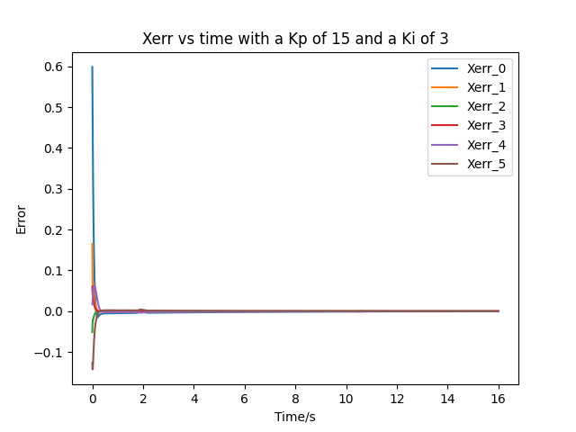
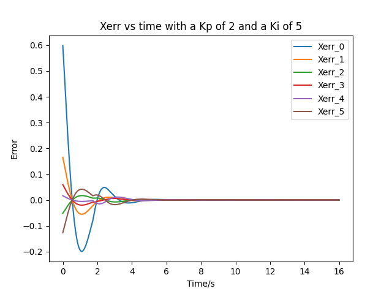
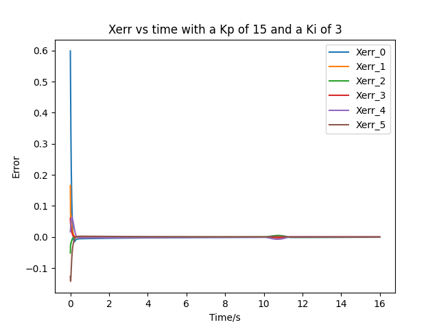

# ME449 Final Project: Youbot Mobile Manipulation 

This is the final project for ME449 at Northwestern done by Jiasen Zheng. 

## Brief Overview

This project aims to control a youbot to pick and place a block from specific positions and then simulate it in Coppeliasim. The algorithm first generates a reference traject of the end-effector and then applies feedback control to manipulate the youbot.


## Algorithm description

The NextState function calculates the robot's configuration at the next time step using the first-order Euler method.

The TrajectoryGenerator function takes in the transformation matrix of some required waypoints and outputs a list of transformation matrices of end-effector with respect to the space frame.

There are 8 stages in the simulation:
1. A trajectory to move the gripper from its initial configuration to a "standoff" configuration a few cm above the block.
2. A trajectory to move the gripper down to the grasp position.
3. Closing of the gripper.
4. A trajectory to move the gripper back up to the "standoff" configuration.
5. A trajectory to move the gripper to a "standoff" configuration above the final configuration.
6. A trajectory to move the gripper to the final configuration of the object.
7. Opening of the gripper.
8. A trajectory to move the gripper back to the "standoff" configuration.

The algorithm uses the ScrewTrajectory function from the modern robotics python library in each stage. The function takes in the start and end Transformation of the gripper. It generates discrete trajectory as a list of end-effector transformation matrices using the third-order/ fifth-order polynomial time-scaling method.

The FeedbackControl function is used to calculate the kinematic task-space feedforward plus feedback control law, shown below.</br>


## Initial setups 

1. The default initial cube postion in world frame is:</br>

2. The default final cube position in world frame is:</br>

3. The initial configuration of the robot is:
```shell
[0.6, -0.2, -0.2, 0, 0, 0.2, -1.6, 0, 0, 0, 0, 0, 0]
```


## Results

Three situations were considered as results.
1. Best: a result with a well-tuned controller with the default cube positon
    * After tunning, a feedforward-plus-PI control with a Kp of 15 and a Ki of 3 is used. The Xerror plot is shown below: </br>
    
2. Overshoot: a result with a less-well-tuned controller with the default cube positon
    * After tunning, a feedforward-plus-PI control with a Kp of 2 and a Ki of 5 is used. The Xerror plot is shown below: </br>
    
3. newTask: a result with another specified initial and final cube position
    * The new initial cube position is (0.5 m, 0.5 m, 0 rad) in the world frame
    * The new final cube position is (0 m, -0.8 m, -pi/2 rad) in the world frame
    * After tunning, a feedforward-plus-PI control with a Kp of 15 and a Ki of 3 is used. The Xerror plot is shown below: </br>
    

## Instruction

* navigate to code directory
* to execute the code, in your terminal, run:
```Shell
python3 code.py
```


